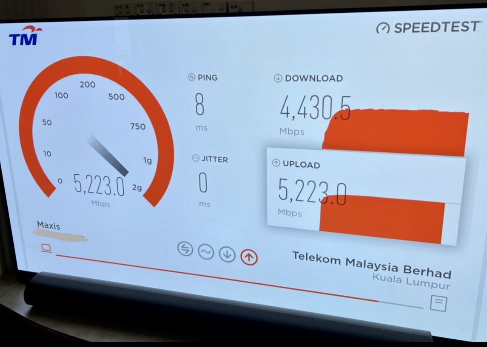
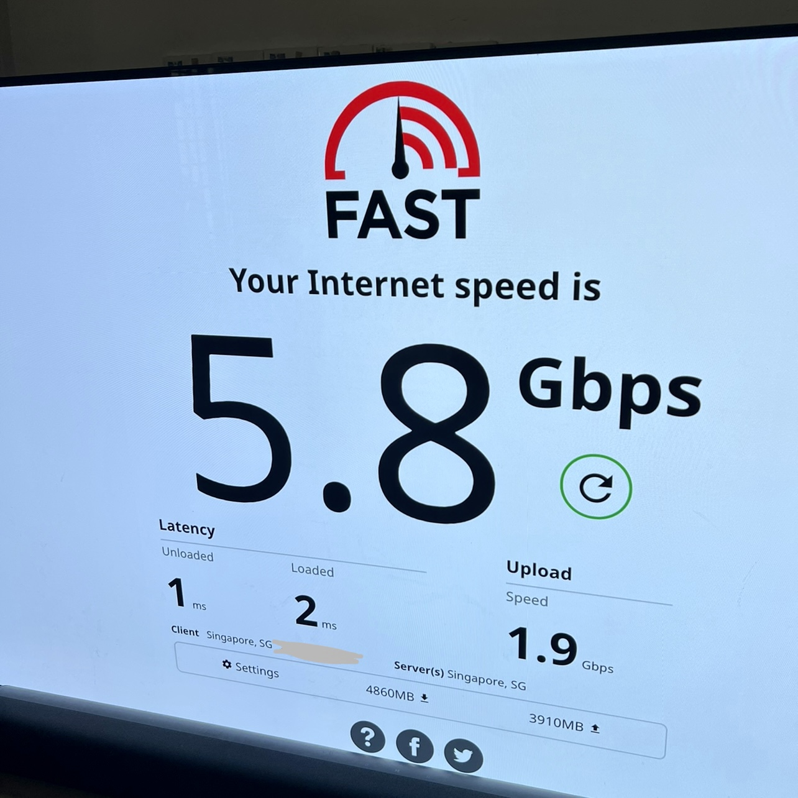

# WIP Multi Gigabit Internet
## Overview
This guide is to share my journey towards multi gigabit internet and give back to the community that helped me achieved this.

## Who is this for
1. Average/advance user that does not want to deal with a lot of router jargons, testing, troubleshooting. 
1. Folks that want to use consumer router - Asus, TP Link (Eww Mikrotik, Ubiquiti).

## Myths to debunk
1. You can get more than 1gbps over wifi - You cant. TLDR: Noise, bandwith, antenna limitations. Long story: here
1. Max out ingress traffic(coming into router WAN) equals fast wifi - Not true. TLDR: Noise, bandwith, antenna limitations. Refer 1.
1. You can reuse existing devices to get multigig internet - Plausible, mainly not true.

## Important things to know
1. You may use this to get more speed from ISP. Subscribe to 1gbps, get over 1gbps. Not guaranteed, most of the time works
1. You need a router that can take more than 1gbps WAN. Existing gigabit port will not give you more speed even you have a faster ingress(incoming source)
1. You need a client to take more than 1gbps ethernet. Exisiting gigabit ethernet will not give you more than 1gbps if say your incoming source provides over 2gbps. You WILL be limited to 1gbps.
1. Wifi6/6E will not give you more bandwidth to hit the magical 1gbps. Your iPhone, Samsung, Laptops(As of 2022 Dec) are mostly 2x2 MIMO antenna. This will not give you multigig speed. If you own a 4x4 MIMO antenna device(Rare in market as of 2022 Dec), then yes, you can get over 1gbps on wifi

## Guide
Coming soon
